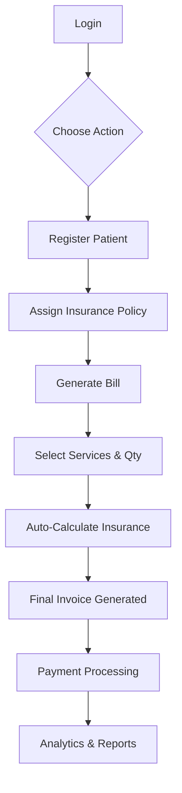

# 🏥 Billing & Insurance Management System (BIMS) - Master Guide

> **A Comprehensive A-Z Documentation for Developers and Stakeholders**

Welcome to the **Billing & Insurance Management System (BIMS)**. This document is designed to be a "single source of truth" that provides everything you need to know to understand, set up, and develop this project from scratch.

---

## 📖 1. Project Overview

### What is BIMS?
BIMS is a modern web-based application designed for hospitals and healthcare providers to streamline their **Patient Management**, **Insurance Claims**, and **Billing Operations**. 

### Why does it exist?
Manual hospital billing is error-prone and time-consuming, especially when dealing with complex insurance deductions. BIMS automates:
1.  **Patient Registration**: Tracking who is being treated.
2.  **Service Master**: Managing a catalog of services (e.g., Blood Test, Room Rent) and their base costs.
3.  **Insurance Integration**: Automatically calculating how much of a bill is covered by a patient's policy.
4.  **Billing & Payments**: Generating professional invoices and tracking whether they are paid.
5.  **Analytics**: Reports to help management understand revenue trends.

---

## 🔄 2. Complete Project Flow (A-Z)

The system follows a logical healthcare workflow:



1.  **Authentication**: Users log in as **Admin**, **Billing**, or **Insurance** staff.
2.  **Patient Entry**: A patient is registered in the system.
3.  **Policy Assignment**: If the patient has insurance, a policy is linked to them (e.g., 80% coverage).
4.  **Service Selection**: Billing staff adds services (Master Health Checkup, Consultation, etc.) to a draft bill.
5.  **Auto-Calculation**: The system calculates:
    *   **Gross Amount**: Total cost of all services.
    *   **Insurance Deduction**: Amount covered by the policy.
    *   **Net Payable**: Amount the patient actually needs to pay.
6.  **Payment**: The bill is marked as "Paid" once the patient pays.
7.  **Reporting**: Admin views reports for any date range to track performance.

---

## 🏗️ 3. Architecture & Structure

### Technology Stack
*   **Framework**: Angular 19+ (using standalone components).
*   **Styling**: Tailwind CSS (Utility-first) + Angular Material (Component-based).
*   **State Management**: RxJS (Observables/Subjects).
*   **Communication**: RESTful API via `HttpClient`.
*   **Charts**: Chart.js for data visualization.

---

## 📂 4. Folder & File Structure

Here is a breakdown of the `src/app` directory where the core logic resides:

```text
src/app/
├── components/          # UI Components (Feature-based)
│   ├── admin/           # Admin features (Service Master, etc.)
│   ├── bill/            # Billing generation and lists
│   ├── dashboard/       # Main overview with stats
│   ├── insurance/       # Policy management and forms
│   ├── patient/         # Patient registration and records
│   ├── payment/         # Payment processing forms
│   ├── shared/          # Reusable UI (Dialogs, Tables, Inputs)
│   └── user/            # User account management
├── core/                # "Core" non-UI logic
│   ├── adapters/        # Custom adapters (e.g., Date Format Adapter)
│   ├── guards/          # Route protection (Auth & Role checking)
│   ├── interceptors/    # Global API hooks (Auth headers, Loading spinner)
│   ├── interfaces/      # Type-safe models for API data
│   └── services/        # API communication logic (Singletons)
├── layout/              # Structural shells
│   └── main-layout/     # Sidebar, Header, and Router-Outlet
├── app.config.ts        # Global application configuration (Providers)
└── app.routes.ts        # Navigation Map (URL to Component)
```

### Key File Locations
*   **App Config**: `src/app/app.config.ts` (Setup for Materials, Toastr, Custom Date Formats).
*   **Routing**: `src/app/app.routes.ts` (Defines access levels per URL).
*   **Base URL**: `src/environment/environment.ts` (API endpoint location).

---

## 🚀 5. Setup & Installation Guide

### Prerequisites
1.  **Node.js**: v18.x or higher.
2.  **Angular CLI**: `npm install -g @angular/cli`.
3.  **Git**: To clone the repository.

### Step-by-Step Installation
1.  **Clone the project**:
    ```bash
    git clone [repository-url]
    cd Billing_Insurance_UI
    ```
2.  **Install dependencies**:
    ```bash
    npm install
    ```
3.  **Configure Environment**:
    Open `src/environment/environment.ts` and ensure `apiUrl` matches your backend server (Default: `https://localhost:7125/api`).
4.  **Run Development Server**:
    ```bash
    ng serve
    ```
5.  **Access the App**:
    Open `http://localhost:4200` in your browser.

---

## 💻 6. Code & Data Flow

### How data travels from API to Screen:
1.  **Trigger**: User clicks "Load Reports" in `ReportsComponent`.
2.  **Service Call**: Component calls `ReportService.getBillingReport(fromDate, toDate)`.
3.  **API Hook**: `AuthInterceptor` automatically adds the JWT Token to the request.
4.  **Loading Indicator**: `LoaderInterceptor` shows a spinner while the request is pending.
5.  **Response**: Data is received, mapped via RxJS, and stored in component variables.
6.  **UI Update**: Angular's **Control Flow** (`@if`, `@for`) renders the data in the template.

### Entry Point
*   `main.ts` bootstraps the application using `appConfig`.
*   `app.component.html` contains the `<router-outlet>` which swaps components based on URL.

---

## ✨ 7. Best Practices Used

1.  **Standalone Components**: No complex `NgModules`. Each component is self-contained.
2.  **New Control Flow**: Using `@if`, `@for`, and `@switch` instead of `*ngIf`/`*ngFor` for better performance.
3.  **Role-Based Security**: Route Guards (`roleGuard`) prevent billing staff from accessing Admin settings.
4.  **Custom Date Standardization**: Implemented a `CustomDateAdapter` to ensure all dates are formatted consistently as `dd-MMM-yyyy` globally.
5.  **Global Error Handling**: Using `ngx-toastr` for consistent success/error notifications.
6.  **Utility-First CSS**: Layouts are built with **Tailwind CSS**, making them highly responsive and easy to maintain.

---

## 🛠️ 8. Troubleshooting & Common Mistakes

*   **API Connection Error**: 
    *   Check if the backend server is running.
    *   Ensure the `apiUrl` in `environment.ts` matches the endpoint exactly (look for `/api` at the end).
*   **Unauthorized (401)**:
    *   Your session may have expired. Clear local storage and log in again.
*   **Date Formatting Shift**:
    *   Avoid using `toLocaleDateString()` directly in logic. Always use the built-in `DatePipe` in HTML: `{{ date | date:'dd-MMM-yyyy' }}`.

---

## 💡 9. Suggestions & Future Enhancements

*   **Better State Management**: As the project grows, consider using **NGXS** or **NgRx** to manage shared state (like global patient search).
*   **PWA Support**: Transform this into a Progressive Web App so hospital staff can use it offline or as a desktop app.
*   **Patient Dashboard**: A dedicated view for patients to download their own invoices using a secure portal.
*   **AI Analytics**: Implement predictive modeling to forecast peak hospital hours and revenue.

---

## 📜 10. Document Maintenance
This document is a living file. If you find a bug or a missing step, please update it to help the next developer!

**Created by**: Lead Technical Architect
**Last Updated**: Jan 2026
