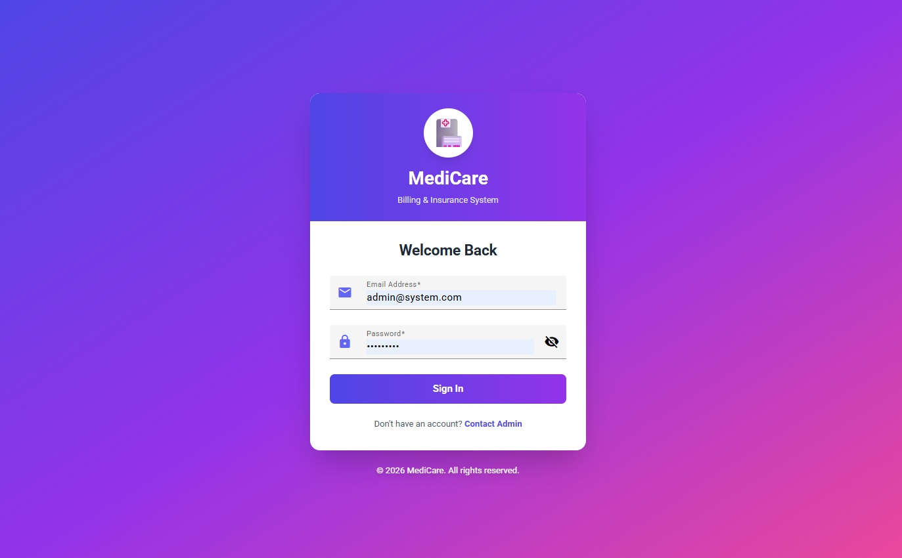
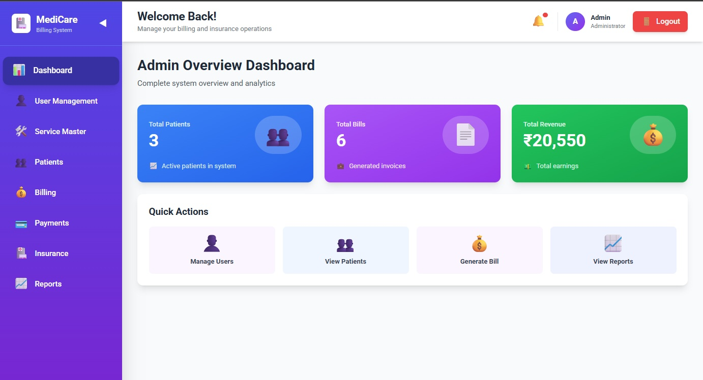
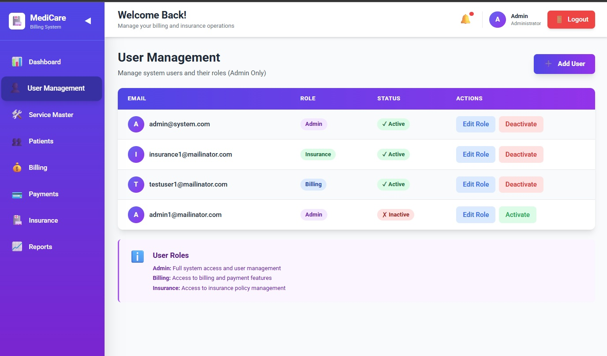
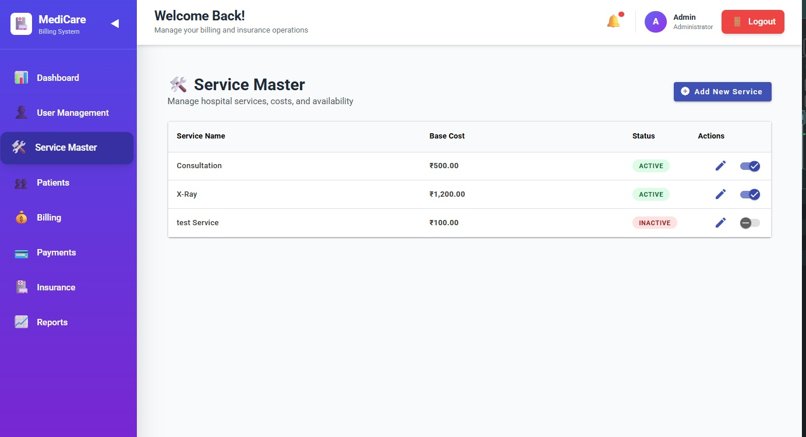
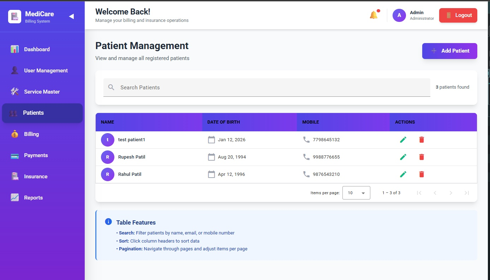
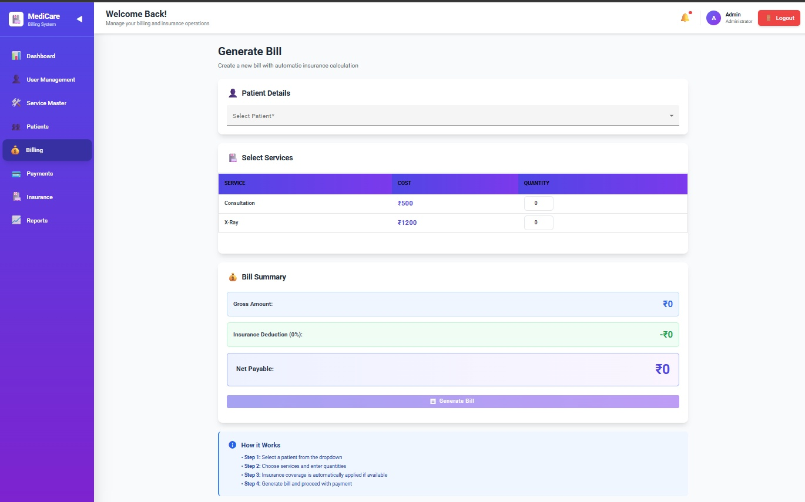
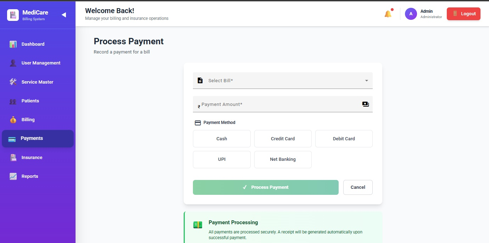
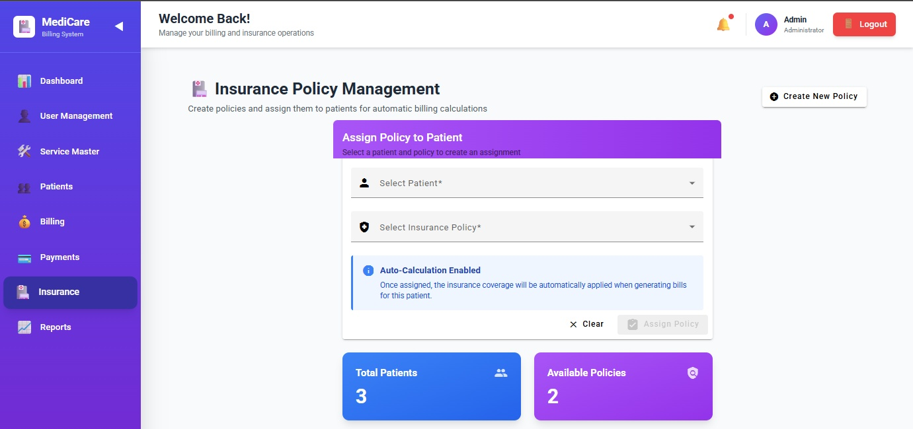
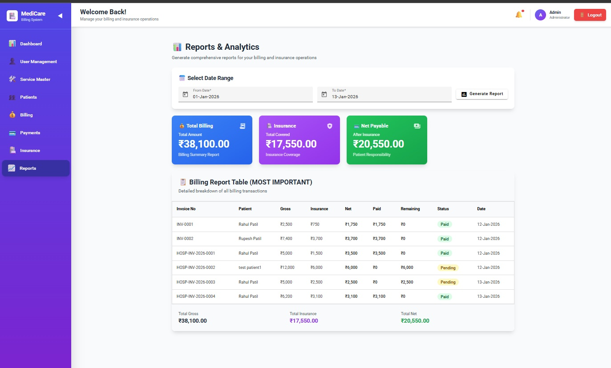

---

## 🔐 Authentication Module

### Login Screen
**File:** `Project_Images/login.jpg`

**Description:**
- Secure login for system users
- Email & password-based authentication
- Role-based access control (Admin, Billing, Insurance)
- Clean and modern UI with branding

**Key Features:**
- Password visibility toggle
- Validation for required fields
- Admin-only account creation

---

## 📊 Admin Dashboard

### Overview Dashboard
**File:** `Project_Images/admin-dashboard.jpg`

**Description:**
- Central overview of system activity
- Quick access to core modules

**Widgets Displayed:**
- Total Patients
- Total Bills Generated
- Total Revenue
- Quick Actions (Users, Patients, Billing, Reports)

---

## 👥 User Management (Admin Only)

### User List & Role Management
**File:** `Project_Images/user-management.jpg`

**Description:**
- Manage all system users and roles
- Activate or deactivate user accounts

**Capabilities:**
- Assign roles: Admin, Billing, Insurance
- Enable / Disable users
- Edit role without deleting users

---

### Create New User Modal
**File:** `Project_Images/create-user-modal.jpg`

**Description:**
- Admin-only user creation dialog

**Fields:**
- Email Address
- Password
- User Role

---

## 🛠️ Service Master

### Hospital Services Management
**File:** `Project_Images/service-master.jpg`

**Description:**
- Manage billable hospital services

**Features:**
- Add / Edit services
- Base cost configuration
- Activate / Deactivate services
- Used dynamically during bill generation

---

## 🧑‍⚕️ Patient Management

### Patient Listing & Search
**File:** `Project_Images/patient-management.jpg`

**Description:**
- Central patient registry

**Functionalities:**
- Search by name or mobile number
- Pagination support
- Edit & delete patient records
- View total patient count

---

## 🧾 Billing Module

### Generate Bill
**File:** `Project_Images/generate-bill.jpg`

**Description:**
- Create patient bills with automatic insurance calculation

**Billing Flow:**
1. Select patient
2. Choose services & quantity
3. Auto-calculate:
   - Gross Amount
   - Insurance Deduction
   - Net Payable
4. Generate bill

---

## 💳 Payments Module

### Process Payment
**File:** `Project_Images/process-payment.jpg`

**Description:**
- Record payments against bills

**Supported Payment Methods:**
- Cash
- Credit Card
- Debit Card
- UPI
- Net Banking

**Outcome:**
- Payment confirmation
- Automatic receipt generation
- Bill balance update

---

## 🛡️ Insurance Management

### Assign Insurance Policy
**File:** `Project_Images/insurance-management.jpg`

**Description:**
- Manage insurance policies and assign them to patients

**Key Points:**
- Policy assignment enables auto-calculation during billing
- Displays total patients and available policies
- Supports multiple insurance providers

---

## 📈 Reports & Analytics (Most Important)

### Billing & Financial Reports
**File:** `Project_Images/reports-analytics.jpg`

**Description:**
- Comprehensive financial reporting module

**Report Features:**
- Date range selection
- Summary cards:
  - Total Billing
  - Insurance Coverage
  - Net Payable
- Detailed billing table with:
  - Invoice number
  - Patient
  - Gross amount
  - Insurance amount
  - Paid & remaining
  - Status (Paid / Pending)

---

## ✅ System Highlights

- Role-Based Access Control (RBAC)
- Insurance-aware billing logic
- Real-time calculations
- Admin-controlled user lifecycle
- Clean, professional UI
- Enterprise-ready modular structure

---

## 🚀 Ideal For

- Hospital Management Systems
- Clinic Billing Software
- Insurance-integrated healthcare platforms
- Academic / client-ready projects

---

© 2026 **MediCare** – Billing & Insurance System  
All rights reserved.
