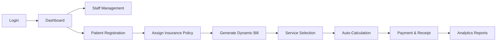

# 🏥 Billing & Insurance Management System (BIMS)

> **A Comprehensive A-Z Documentation for Developers and Stakeholders**

Welcome to the **Billing & Insurance Management System (BIMS)**. This document is the "single source of truth" providing everything you need to know to understand, set up, and develop this project efficiently.

---

## 📖 1. Project Overview

### What is BIMS?
BIMS is a robust healthcare application built for modern hospitals to streamline their **Patient Management**, **Insurance Claims**, and **Billing Ecosystem**. 

### Why BIMS?
In complex healthcare environments, manual billing leads to revenue leakage and patient frustration. BIMS solves this by:
*   **Centralized Patient Records**: One place for all patient data.
*   **Dynamic Service Master**: Manage a catalog of medical services and live costs (CRUD).
*   **Automated Insurance Logic**: Intelligent calculation of co-pays and insurance deductions.
*   **Rich Analytics**: Role-based dashboards and detailed reports for management.

---

## 🔄 2. System Flow (The Developer Journey)

The application follows a standard healthcare workflow designed to be intuitive for all staff roles:



1.  **Identity**: Users enter via a secure login managed by Role-Based Access Control (RBAC).
2.  **Onboarding**: Patients are registered and their insurance details are verified.
3.  **Service Provision**: During billing, staff select services from the **Service Master**.
4.  **Instant Calculation**: The system applies insurance percentages and generates a net payable amount instantly.
5.  **Completion**: Payments are processed, and the system logs everything for the **Admin's Reports**.

---

## 🏗️ 3. Architecture & Technical Breakdown

### Core Stack
*   **Frontend**: Angular 19+ (Standalone Architecture).
*   **UI Components**: Angular Material (Premium Components).
*   **Styling**: Tailwind CSS (Modern, Responsive Utilities).
*   **State & Data**: RxJS Observables for reactive data binding.
*   **Global Handling**: Interceptors for Auth, Logging, and Loaders.

---

## 📂 4. Folder & File Guide

### Root Structure
*   `/src/app/components`: The visual heart of the app. Broken down by feature (Admin, Billing, Patient).
*   `/src/app/core`: The brain of the app. Contains Services (API calls), Guards (Security), and Interceptors (Middleware).
*   `/src/app/layout`: The skeleton (Sidebar, Header, Main Layout).
*   `/src/app/interfaces`: The blueprint (TypeScript Interfaces for all data models).

### Important File Locations
| File Detail | Path | Description |
| :--- | :--- | :--- |
| **Routes** | `src/app/app.routes.ts` | The navigation map and security permissions. |
| **Config** | `src/app/app.config.ts` | Global providers (Animations, Toastr, Date Adapters). |
| **API Base** | `src/environment/environment.ts` | The bridge between the UI and your Backend Server. |
| **Custom Date** | `src/app/core/adapters/custom-date-adapter.ts` | Ensures `dd-MMM-yyyy` across the entire project. |

---

## 🚀 5. Setup & Installation Guide

### Step 1: Prepare your Environment
1.  **Node.js**: Ensure you have v18 or higher installed.
2.  **Angular CLI**: Install globally via `npm install -g @angular/cli`.

### Step 2: Get the Code
```bash
git clone [your-repo-url]
cd Billing_Insurance_UI
```

### Step 3: Install & Start
```bash
npm install     # Install all dependencies
ng serve        # Start the development server
```

### Step 4: Verify
Open `http://localhost:4200`. The default login will redirect you to the dashboard once authenticated.

---

## 💻 6. Data Flow Explanation

When a staff member generates a bill:
1.  **Selection**: The `BillListComponent` fetches active patients and services via their respective Services.
2.  **Calculation**: Logic in the component calculates the gross total.
3.  **Insurance Hook**: If a patient has a policy, the system queries the `InsuranceService` for the coverage percentage.
4.  **Visual Feedback**: The `LoaderInterceptor` tracks the API calls and shows a subtle spinner.
5.  **Persistence**: On clicking "Generate", the data is sent to the `/api/billing` endpoint via `BillingService`.

---

## ✨ 7. Best Practices Implemented

*   **Modern Angular**: Full use of **Control Flow Syntax** (`@if`, `@for`) for cleaner templates.
*   **Type Safety**: Every API response is mapped to a TypeScript `Interface`.
*   **Reusable UI**: Dialogs and tables are moved to the `shared` folder for DRY (Don't Repeat Yourself) code.
*   **Optimized Performance**: Standalone components reduce bundle size and improve load times.
*   **User Experience**: Global notifications (Toastr) and centered loaders for data-heavy views.

---

## ⚠️ 8. Troubleshooting & Tips

*   **Dates looking wrong?** Check the `CustomDateAdapter`. It's hardcoded to force `dd-MMM-yyyy` to match professional standards.
*   **Can't see the Users tab?** You are likely logged in as a "Billing" staff. Only "Admin" roles can see the User Management section.
*   **API not responding?** Double-check your `environment.ts`. Ensure your backend port matches the URL perfectly.

---

## 💡 9. Future Enhancements
*   **Mobile App Integration**: Using Ionic or Capacitor with this codebase.
*   **Export to Excel**: Extend reports to allow CSV/XLSX downloads.
*   **Patient Portal**: Allow patients to login and view their own billing history.

---

## 📜 10. Document Maintenance
This documentation is for you! If you add a new feature or change a core logic, update this file to keep the team informed.

**Technical Architect**: [Your Name/Team]
**Status**: Production Ready (Jan 2026)
